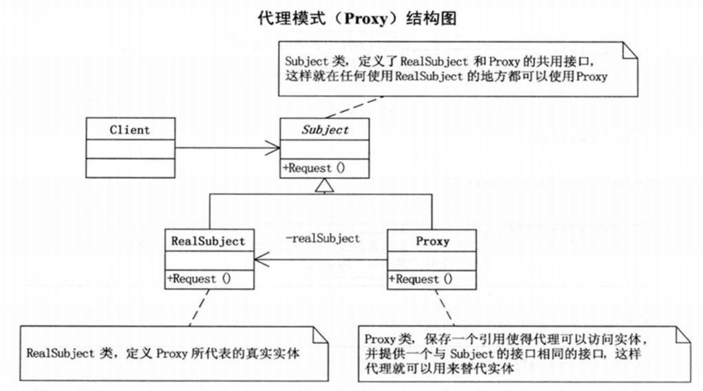
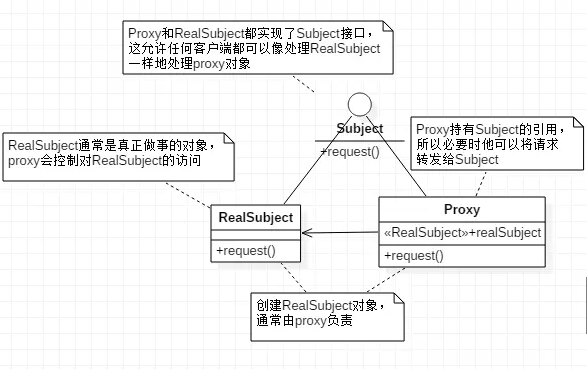
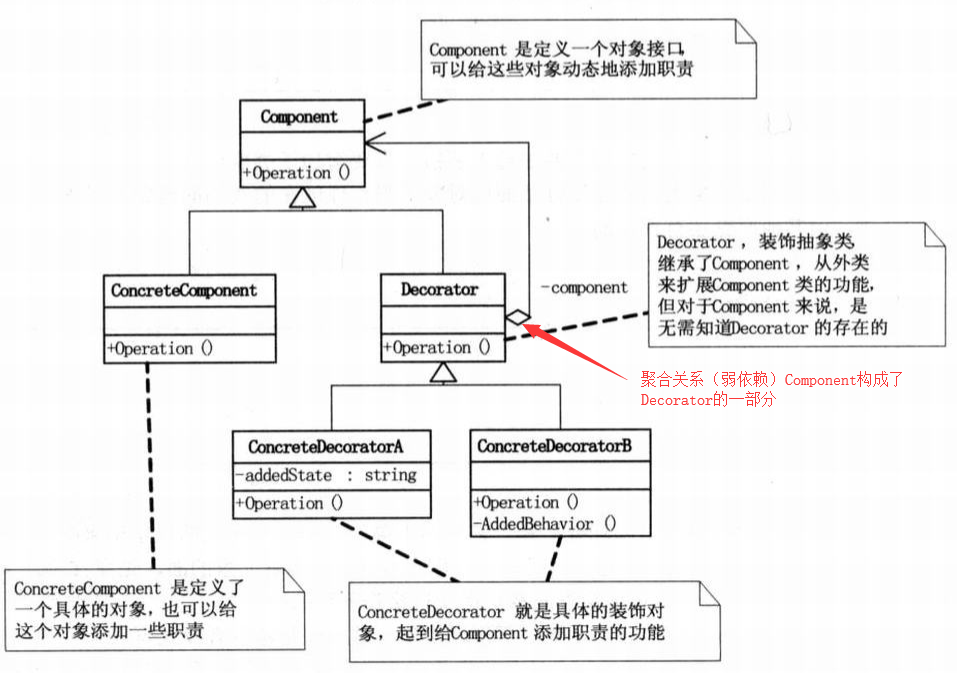
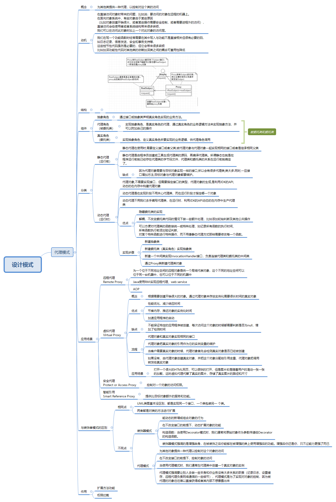

[TOC]

# 代理模式

在详细了解代理模式之前，可能对于像小秋一样的小白，只知道一些很浅显的概念，或者就知道远程代理啊，静态代理啊，动态代理啊，这些看似可以望文生义的专业名词，但是如果我告诉你代理模式贯穿了我们生活的方方面面，就比如你现在刷着公众号的时候，实际上就用了远程代理模式你信吗，当你打开一个很大的网页，你能很快的打开，但是你有没有发现，当你往下滑的时候，图片才开始一张一张的展现出来，这个背后实际上也是用了代理模式，具体是咋回事，和小秋一起看下去吧~

## 概念

为其他类提供一种代理，以控制对这个类的访问

## 动机

在直接访问对象时带来的问题，比如说：要访问的对象在远程的机器上。在面向对象系统中，有些对象由于某些原因（比如对象创建开销很大，或者某些操作需要安全控制，或者需要进程外的访问），直接访问会给使用者或者系统结构带来很多麻烦，我们可以在访问此对象时加上一个对此对象的访问层。

## 结构



## 组件

- 抽象角色

通过接口或抽象类声明真实角色实现的业务方法。

- 代理角色

实现抽象角色，是真实角色的代理，通过真实角色的业务逻辑方法来实现抽象方法，并可以附加自己的操作

- 真实角色

实现抽象角色，定义真实角色所要实现的业务逻辑，供代理角色调用

## 分类

### 静态代理

静态代理在使用时,需要定义接口或者父类,被代理对象与代理对象一起实现相同的接口或者是继承相同父类

#### 实现

这里引用《大话设计模式》里面的一个例子说明:追求者找同学送礼物给女神

```java
package proxy;

public class Girl {
    private String name;
    private int age;

    public Girl(String name) {
        this.name = name;
    }

    public String getName() {
        return name;
    }
}

```

抽象角色

```java
package proxy;

public interface SendGift {
    public void sendFlower();

    public void sendCake();
}

```

真实角色

```java
package proxy;

public class  Persuit implements SendGift {
    private Girl girl;

    public Persuit(Girl girl) {
        this.girl = girl;
    }

    @Override
    public void sendFlower() {
        System.out.println(girl.getName() + "送你花");
    }

    @Override
    public void sendCake() {

        System.out.println(girl.getName() + "送你蛋糕");
    }
}
```

代理角色

```java
package proxy;

public class Proxy implements SendGift {
    private Persuit persuit;

    public Proxy(Girl girl){
        persuit = new Persuit(girl);

    }

    @Override
    public void sendFlower() {
        persuit.sendFlower();

    }

    @Override
    public void sendCake() {

        persuit.sendCake();
    }
}

```

### 动态代理

- 代理对象,不需要实现接口，但需要指定接口的类型
- 代理对象的生成,是利用JDK的API,动态的在内存中构建代理对象(需要我们指定创建代理对象/目标对象实现的接口的类型)
- 动态代理也叫做:JDK代理,接口代理

下面我们用动态代理的方式实现上面送礼物的过程

- 首先先创建抽象委托类

```java
package dynamic;
//委托抽象类

public interface SendGift {
    public boolean sendFlower();

    public boolean sendCake();
}
```

- 然后创建具体委托类

```java
package dynamic;

public class Girl {
    private String name;
    private int age;

    public Girl(String name) {
        this.name = name;
    }

    public String getName() {
        return name;
    }
}

```

```java
package dynamic;

import static java.lang.Thread.sleep;

//真实委托类
public class Persuit implements SendGift {


    private Girl girl;

    private String name;

    public Persuit(Girl girl, String name) {
        this.girl = girl;
        this.name = name;
    }

    public String getName() {
        return name;
    }

    @Override
    public boolean sendFlower() {
        System.out.println( name +"送"+girl.getName()+"花");
        return true;
    }

    @Override
    public boolean sendCake() {
        System.out.println( name +"送"+girl.getName()+"蛋糕");

        return true;
    }
}
```

- 创建中间类实现InvocationHandler接口

```java
package dynamic;

import java.lang.reflect.InvocationHandler;
import java.lang.reflect.Method;

public class TimingInvocationHandler implements InvocationHandler {

    private Object target;
    //    private Persuit target;这里的成员变量类型可以换成object类型

    public TimingInvocationHandler(Object target) {
        super();
        this.target = target;
    }
    public TimingInvocationHandler() {
        super();
    }

    /**
     *
     * @param proxy 通过Proxy.newProxyInstance()生成的代理类对象
     * @param method 表示代理对象被调用的函数
     * @param args 表示代理类对象被调用的函数的参数
     * @return
     * @throws Throwable
     */
    @Override
    public Object invoke(Object proxy, Method method, Object[] args) throws Throwable {
        System.out.println("开始送礼物");
        //target 属性表示真实委托类对象。
        Object obj = method.invoke(target, args);

        System.out.println("送礼物完成");

        return obj;
    }
}
```

- 客户端通过proxy类新建代理对象

```java
package dynamic;

import java.lang.reflect.Proxy;

public class Client {
    public static void main(String[] args) throws InterruptedException {
        Girl girl = new Girl("芳芳");
        TimingInvocationHandler timingInvocationHandler
                = new TimingInvocationHandler(new Persuit(girl,"小王"));

        SendGift sendGift = (SendGift) Proxy.newProxyInstance(SendGift.class.getClassLoader(), new Class[]{SendGift.class},
                timingInvocationHandler);


        // call method of proxy instance

        sendGift.sendCake();

        sendGift.sendFlower();
    }
}
//    开始送礼物
//    小王送芳芳蛋糕
//    送礼物完成
//    始送礼物
//    小王送芳芳花
//    送礼物完成
```

## 应用场景

### 远程代理

#### 概念

为一个位于不同地址空间的远程对象提供一个局域代表对象，这个不同的地址空间可以位于同一台机器中，也可以位于不同的机器中

#### 应用场景

Java使用RMI实现远程代理、web service

### 虚拟代理

#### 概念

根据需要创建开销很大的对象。通过代理对象来存放实例化需要很长时间的真实对象

#### 优点

- 性能优化，减少响应时间
- 节省内存，推迟对象的实例化时间
- 加速应用程序的启动

#### 缺点

- 不能保证特定的应用程序被创建，每次访问这个对象的时候都需要判断是否为null，增加了检测时间

#### 流程

- 代理对象和真实对象实现相同的接口
- 代理对象把真实对象的引用作为它的实例变量的维护
- 当客户需要真实对象的时候，代理对象首先会检测真实对象是否已经被创建
- 如果没有，由代理对象创建真实对象，并把这个对象分配给引用变量，代理对象把调用转发给真实对象

#### 应用场景

打开一个很大的HTML网页，可以很快的打开，但是图片却是随着用户的滑动一张一张的加载，这时虚拟代理代替了真实的图片，存储了真实图片的路径和尺寸

### 安全代理

控制对一个对象的访问权限。

## 与装饰者模式的区别

### 相同点

- UML类图基本没区别，都是实现同一个接口，一个类包装另一 个类。
- 两者都是对类的方法进行扩展

代理模式的结构图



装饰者模式的结构图



### 不同点

- 对对象的作用

装饰者：动态的新增或组合对象的行为，在不改变接口的前提下，动态扩展对象的功能

代理模式：为其他对象提供一种代理以控制对这个对象的访问，在不改变接口的前提下，控制对象的访问

- 如何使用该对象

装饰者：通常将原始对象作为参数传递给Decorator的构造函数。

代理模式：代理类中创建一个真实对象的实例

- 模式的核心

装饰者：强调的是增强自身，在被装饰之后你能够在被增强的类上使用增强后的功能。增强后你还是你，只不过能力更强了而已

代理模式：强调要让别人去做一些本身和你业务没有太多关系的职责（记录日志，设置缓存，远程代理负责网络通信的一些细节），代理模式是为了实现对对象的控制，因为被代理的对象往往难以直接获得或者其内部不想暴露出来

最后贴上一张概览图，复习一下~现在是不是觉得豁然开朗




参考

[菜鸟教程](https://www.runoob.com/design-pattern/proxy-pattern.html)

[Java的三种代理模式](https://www.cnblogs.com/cenyu/p/6289209.html)

[设计模式之---代理模式(AOP的原理)](https://blog.csdn.net/qq_34178598/article/details/78630934)

[[Java的三种代理模式]](https://segmentfault.com/a/1190000009235245)

