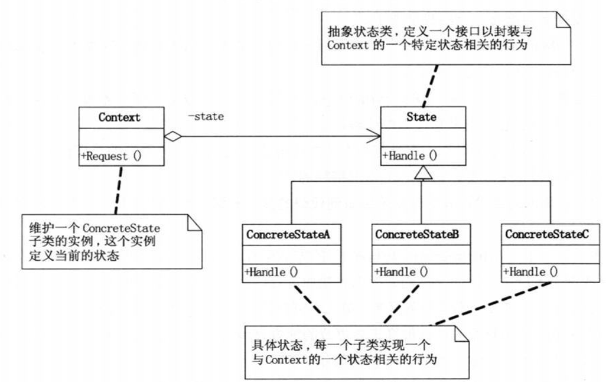
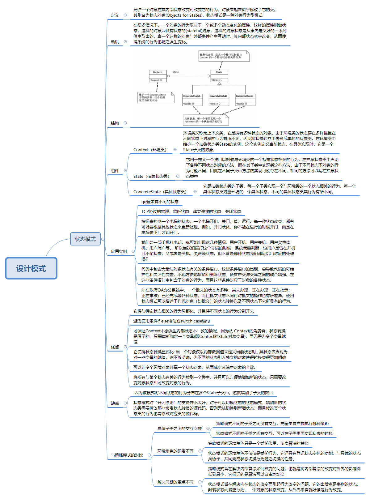

[TOC]


# 状态模式

想必每个程序员坐电梯的时候肯定对电梯的工作流程都有过一定的思考，今天我们就来谈谈电梯是如何工作的，是什么样的机制保证了它在停下来的时候才会开门，在关了门之后才会启动，这种状态与行为之间的关系到底是如何控制的呢，这时状态模式就派上用场啦

## 定义

允许一个对象在其内部状态改变时改变它的行为，对象看起来似乎修改了它的类。
其别名为状态对象(Objects for States)，状态模式是一种对象行为型模式

## 动机

在很多情况下，一个对象的行为取决于一个或多个动态变化的属性，这样的属性叫做状态，这样的对象叫做有状态的(stateful)对象，这样的对象状态是从事先定义好的一系列值中取出的。当一个这样的对象与外部事件产生互动时，其内部状态就会改变，从而使得系统的行为也随之发生变化。

## 结构



## 组件

- Context（环境类）

  环境类又称为上下文类，它是拥有多种状态的对象。由于环境类的状态存在多样性且在不同状态下对象的行为有所不同，因此将状态独立出去形成单独的状态类。在环境类中维护一个抽象状态类State的实例，这个实例定义当前状态，在具体实现时，它是一个State子类的对象。

- State（抽象状态类）

  它用于定义一个接口以封装与环境类的一个特定状态相关的行为，在抽象状态类中声明了各种不同状态对应的方法，而在其子类中实现类这些方法，由于不同状态下对象的行为可能不同，因此在不同子类中方法的实现可能存在不同，相同的方法可以写在抽象状态类中

- ConcreteState（具体状态类）

  它是抽象状态类的子类，每一个子类实现一个与环境类的一个状态相关的行为，每一个具体状态类对应环境的一个具体状态，不同的具体状态类其行为有所不同。

## 实现

这里我们模拟一个QQ的状态转换过程

抽象状态类

```java
package state;

public interface State {
    public void handle(Context context);
}
```

拥有多种状态的对象

```java
package state;

public class Context {
    private State state;

    public State getState() {
        return state;
    }

    public void setState(State state) {
        this.state = state;
    }

    public Context(State state) {
        this.state = state;
    }

    public void  contexthandle(){
        state.handle(this);
    }
}
```

具体状态类

```java
package state;

public class ConcreteState implements State {
    @Override
    public void handle(Context context) {
        System.out.println("忙碌状态");
        //状态转换
        context.setState(new ConcreteStateC());
    }
}
```

具体状态类

```java
package state;

public class ConcreteStateB implements State {
    @Override
    public void handle(Context context) {
        System.out.println("离线状态");
        //状态转换
        context.setState(new ConcreteState());
    }
}
```

具体状态类

```java
package state;

public class ConcreteStateC implements  State{
    @Override
    public void handle(Context context) {
        System.out.println("在线状态");
        //状态转换
        context.setState(new ConcreteStateB());
    }
}
```

客户端

```java
package state;

public class Client {
    public static void main(String[] args){

        Context context = new Context(new ConcreteStateC());
         context.contexthandle();
        context.contexthandle();
        context.contexthandle();
        context.contexthandle();
        context.contexthandle();
        context.contexthandle();
        context.contexthandle();
        context.contexthandle();


    }
}
/**
 * 在线状态
 离线状态
 忙碌状态
 在线状态
 离线状态
 忙碌状态
 在线状态
 离线状态
 */
```

## 应用案例

共同的特点：对象的行为依赖于它的状态（属性）并且可以根据它的状态改变而改变它的相关行为

- 按钮来控制一个电梯的状态，一个电梯开们，关门，停，运行。每一种状态改变，都有可能要根据其他状态来更新处理。例如，开门状体，你不能在运行的时候开门，而是在电梯定下后才能开门。
- 我们给一部手机打电话，就可能出现这几种情况：用户开机，用户关机，用户欠费停机，用户消户等。 所以当我们拨打这个号码的时候：系统就要判断，该用户是否在开机且不忙状态，又或者是关机，欠费等状态。但不管是那种状态我们都应给出对应的处理操作
- 如在政府OA办公系统中，一个批文的状态有多种：尚未办理；正在办理；正在批示；正在审核；已经完成等各种状态，而且批文状态不同时对批文的操作也有所差异。使用状态模式可以描述工作流对象（如批文）的状态转换以及不同状态下它所具有的行为。
- TCP协议的实现：监听状态，建立连接的状态，关闭状态
- qq登录有不同的状态：忙碌，在线，离线等，不同的状态决定不同的操作
- TCP协议的实现：监听状态，建立连接的状态，关闭状态

## 优点

- 基于继承的角度
  - 它将与特定状态相关的行为局部化，并且将不同状态的行为分割开来
  - 避免使用条件if else语句或switch case语句
  - 为不同的状态引入独立的对象使得转换变得更加明确
  - 将所有与某个状态有关的行为放到一个类中，并且可以方便地增加新的状态，只需要改变对象状态即可改变对象的行为。

- 基于状态转换的角度
  - 可保证Context不会发生内部状态不一致的情况，因为从 Context的角度看，状态转换是原子的—只需重新绑定一个变量(即Context的State对象变量)，而无需为多个变量赋值

- 基于内存考虑
  - 可以让多个环境对象共享一个状态对象，从而减少系统中对象的个数。

## 缺点

- 状态模式对“开闭原则”的支持并不太好，对于可以切换状态的状态模式，增加新的状态类需要修改那些负责状态转换的源代码，否则无法切换到新增状态；而且修改某个状态类的行为也需修改对应类的源代码。
-  因为该模式将不同状态的行为分布在多个State子类中。这就增加了子类的数目

## 与策略模式的对比

- 具体子类之间的交互问题
  - 策略模式不同的子类之间没有交互，完全由客户端执行哪种策略
  - 状态模式不同的子类之间有交互，可以在子类里面实现状态的转换

- 环境角色的职责不同
  - 策略模式的环境角色只是一个委托作用，负责算法的替换
  - 状态模式的环境角色不仅仅是委托行为，它还具有登记状态变化的功能，与具体的状态类协作，共同完成状态切换行为随之切换的任务。
- 解决问题的重点不同
  - 策略模式旨在解决内部算法如何改变的问题，也就是将内部算法的改变对外界的影响降低到最小，它保证的是算法可以自由地切换
  - 状态模式旨在解决内在状态的改变而引起行为改变的问题，它的出发点是事物的状态，封装状态而暴露行为，一个对象的状态改变，从外界来看就好像是行为改变。

## 概览图



## 参考

《大话设计模式》

《设计模式之禅》

[状态模式](https://design-patterns.readthedocs.io/zh_CN/latest/behavioral_patterns/state.html)

[设计模式的应用场景(15)--状态模式](https://blog.csdn.net/zhi_fu/article/details/77688193)

[状态模式（State）](https://juejin.im/post/5a3ca75551882515945ac5ff)

[32.2　策略模式VS状态模式](https://www.kancloud.cn/sstd521/design/193631)

