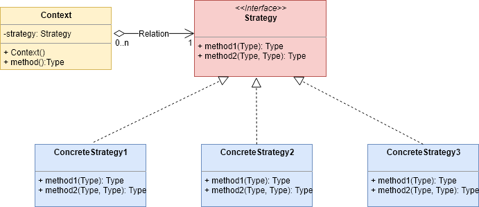
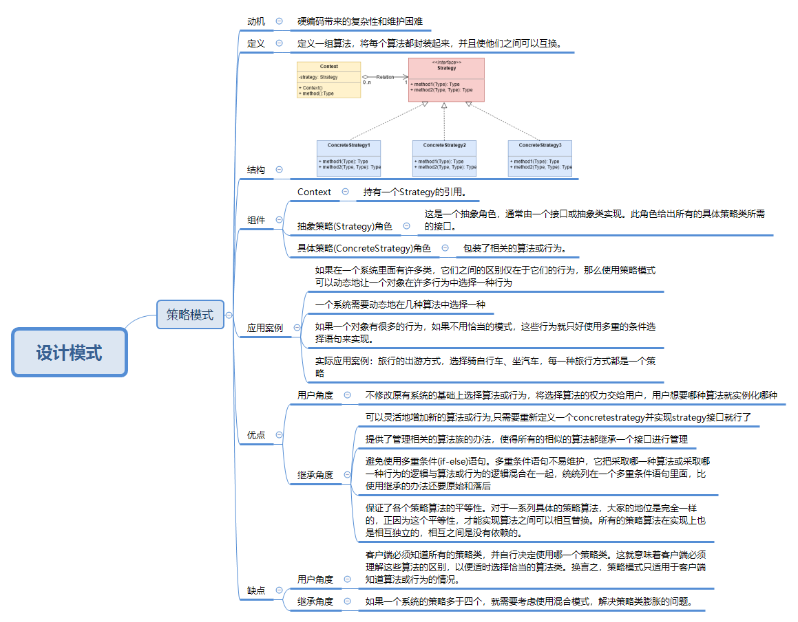

# 策略模式
我们都知道商场打折的时候，会根据会员的等级情况进行不同的折扣优惠，如果是VIP会员，那么可能就是5折优惠，如果是一般会员就是8折优惠，如果是普通顾客就是9折优惠，那么在结账的时候如何根据会员的等级进行不同的计算价格的方式呢？那么这个时候策略模式就派上用场了

## 定义

定义一组算法，将每个算法都封装起来，并且使他们之间可以互换。

## 动机

​	在软件系统中，有许多算法可以实现某一功能，如查找、排序等，一种常用的方法是硬编码(Hard Coding)在一个类中，如需要提供多种查找算法，可以将这些算法写到一个类中，在该类中提供多个方法，每一个方法对应一个具体的查找算法；

​	当然也可以将这些查找算法封装在一个统一的方法中，通过if…else…等条件判断语句来进行选择。

​	这两种实现方法我们都可以称之为硬编码，如果需要增加一种新的查找算法，需要修改封装算法类的源代码；更换查找算法，也需要修改客户端调用代码。在这个算法类中封装了大量查找算法，该类代码将较复杂，维护较为困难。

## 结构



## 组件

- Context：持有一个Strategy的引用。
- 抽象策略(Strategy)角色：这是一个抽象角色，通常由一个接口或抽象类实现。此角色给出所有的具体策略类所需的接口。
- 具体策略(ConcreteStrategy)角色：包装了相关的算法或行为。

## 实现

strategy类

```java
package Strategy;

public interface Strategy {
    public void method1();

    public void method2();
}
```

具体策略

```java
package Strategy;

public class ConcreteStrategy1 implements Strategy {
    @Override
    public void method1() {
        System.out.println("ConcreteStrategy1===算法1-version1");
    }

    @Override
    public void method2() {

        System.out.println("ConcreteStrategy1===算法2-version1");
    }
}

```

```java
package Strategy;

public class ConcreteStrategy2 implements Strategy {
    @Override
    public void method1() {
        System.out.println("ConcreteStrategy2===算法1-version2");
    }

    @Override
    public void method2() {

        System.out.println("ConcreteStrategy2====算法2-version2");
    }
}
```

context

```java
package Strategy;

public class Context {

    private Strategy strategy;

    public Context(Strategy strategy) {
        this.strategy = strategy;
    }

    public void method(){
        System.out.println("选择算法：" );
        strategy.method1();
        strategy.method2();

    }

}
```

client

```java
package Strategy;

public class Client {
    public static void main(String[] args){

        Strategy concreteStrategy1 = new ConcreteStrategy1();
        Context context = new Context(concreteStrategy1);
        context.method();

        Strategy concreteStrategy2 = new ConcreteStrategy2();
        Context context1 = new Context(concreteStrategy2);
        context1.method();
    }
}
//选择算法：
//        ConcreteStrategy1===算法1-version1
//        ConcreteStrategy1===算法2-version1
//选择算法：
//        ConcreteStrategy2===算法1-version2
//        ConcreteStrategy2====算法2-version2
```

## 应用案例

- 如果在一个系统里面有许多类，它们之间的区别仅在于它们的行为，那么使用策略模式可以动态地让一个对象在许多行为中选择一种行为
- 一个系统需要动态地在几种算法中选择一种
- 如果一个对象有很多的行为，如果不用恰当的模式，这些行为就只好使用多重的条件选择语句来实现。

实际应用案例：旅行的出游方式，选择骑自行车、坐汽车，每一种旅行方式都是一个策略

strategy

```java
package Strategy;

public interface Strategy {
    public void travel();

}
```

ConcreteStrategy1

```java
package Strategy;

public class ConcreteStrategy1 implements Strategy {

    @Override
    public void travel() {
        System.out.println("坐飞机");
    }
}
```

ConcreteStrategy2

```java
package Strategy;

public class ConcreteStrategy2 implements Strategy {
    @Override
    public void travel() {
        System.out.println("坐火车");
    }
}
```

context

```java
package Strategy;

public class Context {

    private Strategy strategy;

    public Context(Strategy strategy) {
        this.strategy = strategy;
    }

    public void method(){
        System.out.println("选择出行方式：" );
        strategy.travel();

    }

}
```

client

```java
package Strategy;

public class Client {
    public static void main(String[] args){

        Strategy concreteStrategy1 = new ConcreteStrategy1();
        Context context = new Context(concreteStrategy1);
        context.method();

        Strategy concreteStrategy2 = new ConcreteStrategy2();
        Context context1 = new Context(concreteStrategy2);
        context1.method();
    }
}
//选择出行方式：
//        坐飞机
//选择出行方式：
//        坐火车
```

## 优点

- 继承方面看（strategy-concreteStrategy）
  - 可以灵活地增加新的算法或行为,只需要重新定义一个concretestrategy并实现strategy接口就行了
  - 提供了管理相关的算法族的办法，使得所有的相似的算法都继承一个接口进行管理
  - 避免使用多重条件(if-else)语句。多重条件语句不易维护，它把采取哪一种算法或采取哪一种行为的逻辑与算法或行为的逻辑混合在一起，统统列在一个多重条件语句里面，比使用继承的办法还要原始和落后
  - 保证了各个策略算法的平等性。对于一系列具体的策略算法，大家的地位是完全一样的，正因为这个平等性，才能实现算法之间可以相互替换。所有的策略算法在实现上也是相互独立的，相互之间是没有依赖的。

- 从用户的角度来看
  - 不修改原有系统的基础上选择算法或行为，将选择算法的权力交给用户，用户想要哪种算法就实例化哪种

## 缺点

- 继承方面看
  - 如果一个系统的策略多于四个，就需要考虑使用混合模式，解决策略类膨胀的问题。

- 用户角度看
  - 客户端必须知道所有的策略类，并自行决定使用哪一个策略类。这就意味着客户端必须理解这些算法的区别，以便适时选择恰当的算法类。换言之，策略模式只适用于客户端知道算法或行为的情况。

## 策略模式概览图




## 参考

- [菜鸟教程](https://www.runoob.com/design-pattern/strategy-pattern.html)
- [5. 策略模式](https://design-patterns.readthedocs.io/zh_CN/latest/behavioral_patterns/strategy.html)
- [十种常用的设计模式(大部分自己总结，部分摘抄)](https://blog.csdn.net/dean_hu/article/details/71195133)
- [《JAVA与模式》之策略模式](https://www.cnblogs.com/java-my-life/archive/2012/05/10/2491891.html)

