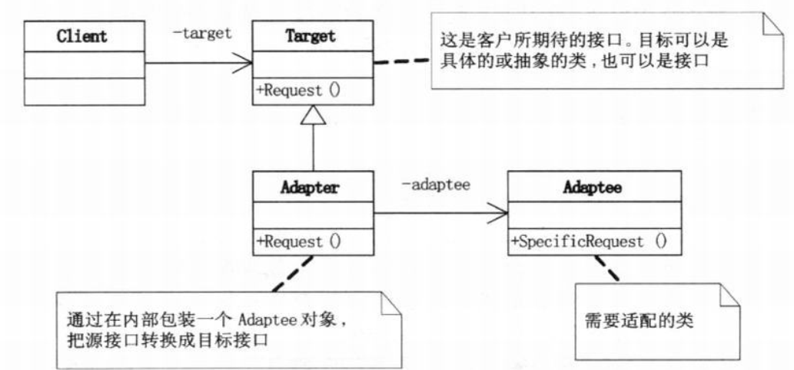
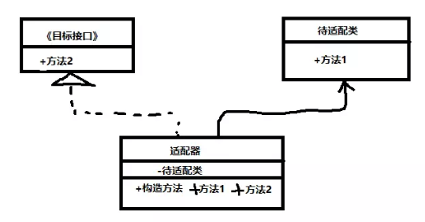
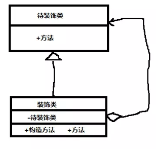
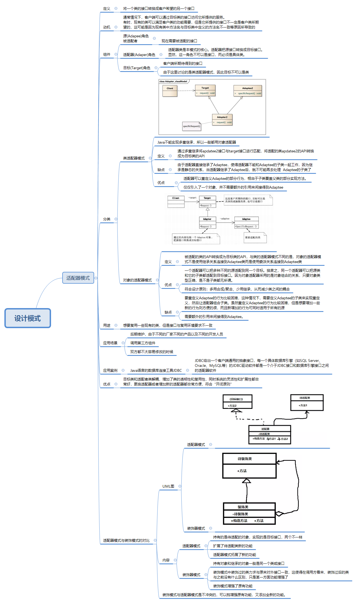

[TOC]

# 适配器模式

说到适配器，小秋第一想到的是我们电脑的电源适配器，它能够将220v,110v等不同电压转换为我们电脑需要的电压值供电脑使用，那么你知道适配器模式是怎样实现的吗，下面就和小秋一起探索一下适配器的工作模式吧

## 定义

将一个类的接口转换成客户希望的另一个接口

## 动机

通常情况下，客户端可以通过目标类的接口访问它所提供的服务。有时，现有的类可以满足客户类的功能需要，但是它所提供的接口不一定是客户类所期望的，这可能是因为现有类中方法名与目标类中定义的方法名不一致等原因所导致的。

## 组件

- 目标(Target)角色：客户端所期待得到的接口，

- 适配器(Adaper)角色：适配器类是本模式的核心。适配器把源接口转换成目标接口。显然，这一角色不可以是接口，而必须是具体类。
- 源(Adapee)角色被适配者：现在需要被适配的接口

## 分类

### 类适配器模式

#### 定义

通过多重继承将apdatee2接口与target接口进行匹配，将适配的类apdatee2的API转换成为目标类的API

#### 结构



#### 优点

- 适配器可以重定义Adaptee的部分行为，相当于子类覆盖父类的部分实现方法。
- 仅仅引入了一个对象，并不需要额外的引用来间接得到Adaptee

#### 缺点

由于适配器直接继承了Adaptee，使得适配器不能和Adaptee的子类一起工作，因为继承是静态的关系，当适配器继承了Adaptee后，就不可能再去处理  Adaptee的子类了

### 对象的适配器模式

#### 定义

被适配的类的API转换成为目标类的API，与类的适配器模式不同的是，对象的适配器模式不是使用继承关系连接到Adaptee类而是使用委派关系连接到Adaptee类

#### 结构


#### 优点

- 一个适配器可以把多种不同的源适配到同一个目标。换言之，同一个适配器可以把源类和它的子类都适配到目标接口。因为对象适配器采用的是对象组合的关系，只要对象类型正确，是不是子类都无所谓。

- 符合设计原则：多用合成/聚合、少用继承，从而减少类之间的耦合

#### 缺点

- 要重定义Adaptee的行为比较困难，这种情况下，需要定义Adaptee的子类来实现重定义，然后让适配器组合子类。虽然重定义Adaptee的行为比较困难，但是想要增加一些新的行为则方便的很，而且新增加的行为可同时适用于所有的源
- 需要额外的引用来间接得到Adaptee。

#### 实现

目标接口（客户端调用的接口）

```java
package adapter;

//目标接口（客户端需要使用的接口）
public interface Target {
    //客户端需要请求处理的方法
    public void request();
}

```

源接口（需要被适配的接口）

```java
package adapter;

//源接口（已经存在的接口）
//需要被转换的对象
//这个接口需要重新配置以适应目标接口
public class Adaptee {

    public void specifiRequest() {
        System.out.println("源接口对象调用源接口中的方法");
    }
}

```

适配器

```java
package adapter;

public class Adapter implements Target {

    //持有源接口对象
    private Adaptee adaptee;

    /**
     * 构造方法，传入需要被适配的对象
     * @param adaptee
     */
    public Adapter(Adaptee adaptee) {
        this.adaptee = adaptee;
    }

    /**
     * 重写目标接口的方法，以适应客户端的需求
     */
    @Override
    public void request() {
        //调用源接口的方法
        System.out.println("适配器包装源接口对象，调用源接口的方法");
        adaptee.specifiRequest();
    }
}
```

客户端

```java
package adapter;

public class Client {
    public static void main(String[] args){

        //创建源对象（被适配的对象）
        Adaptee adaptee = new Adaptee();
        //利用源对象对象一个适配器对象，提供客户端调用的方法
        Adapter adapter = new Adapter(adaptee);
        System.out.println("客户端调用适配器中的方法");
        adapter.request();

    }
}
//客户端调用适配器中的方法
//适配器包装源接口对象，调用源接口的方法
//源接口对象调用源接口中的方法
```

### 优点

目标类和适配者类解耦，增加了类的透明性和复用性，同时系统的灵活性和扩展性都非常好，更换适配器或者增加新的适配器都非常方便，符合“开闭原则”

### 缺点

过多的使用适配器，会让系统非常零乱，不易整体进行把握。比如，明明看到调用的是A接口，其实内部被适配成了B接口的实现

### 应用案例

Java语言的数据库连接工具JDBC，JDBC给出一个客户端通用的抽象接口，每一个具体数据库引擎（如SQL Server、Oracle、MySQL等）的JDBC驱动软件都是一个介于JDBC接口和数据库引擎接口之间的适配器软件

### 应用场景

- 后期维护，由于不同的厂家不同的产品以及不同的开发人员
- 调用第三方组件
- 双方都不太容易修改的时候

### 用途

想要复用一些现有的类，但是接口与复用环境要求不一致

### 适配器模式与装饰模式的对比

#### UML图

- 适配器模式



- 装饰器模式



#### 内容

- 适配器模式
  - 持有的是待适配的对象，实现的是目标接口，两个不一样
  - 扩展了待适配类新的功能
  - 适配器模式拓展了新的功能

- 装饰器模式
  - 持有对象和继承的对象一般是同一个类或接口
  - 装饰模式中装饰过的类力求与原来对外接口一致，这使得在调用方看来，装饰过后的类与之前没有什么区别，只是某一方面功能增强了
  - 装饰模式增强了原有功能

#### 总结

'装饰模式与适配器模式是不冲突的，可以既增强原有功能，又添加全新的功能。

最后附上一张适配器的概览图



## 参考

[适配器模式](<https://design-patterns.readthedocs.io/zh_CN/latest/structural_patterns/adapter.html>)

[《JAVA与模式》之适配器模式](https://www.cnblogs.com/java-my-life/archive/2012/04/13/2442795.html)

[【Java基础】浅谈常见设计模式](https://www.cnblogs.com/cr330326/p/5627658.html)

[适配器模式原理及实例介绍](https://www.ibm.com/developerworks/cn/java/j-lo-adapter-pattern/index.html)

[适配器模式、装饰模式、代理模式的异同](https://www.jianshu.com/p/3f46aaf836e4)